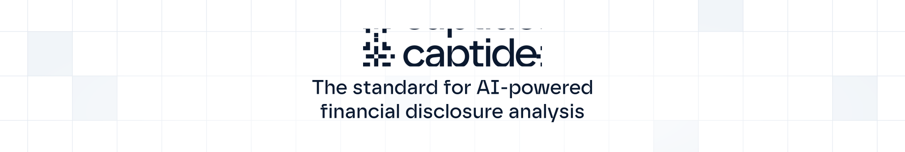

<div align="center">
  
  <h1>captide.js</h1>
  <p>
    <a href="https://www.npmjs.com/package/captide"></a>
    <a href="https://www.npmjs.com/package/captide"></a>
    <a href="https://github.com/captide/captide.js/blob/main/LICENSE"></a>
    <a href="https://www.linkedin.com/company/captide"></a>
  </p>
  <p><strong><a href="https://captide.co">Visit our website</a> | <a href="https://app.captide.co">Try our app</a> | <a href="https://docs.captide.co">Documentation</a></strong></p>
  <br/>
</div>

## Overview

Captide enables precise querying across over 750,000 SEC filings and earnings calls, offering best-in-class accuracy for financial analysis. It streamlines data extraction, investment research, and document review—accessible through a user-friendly interface at [app.captide.co](https://app.captide.co) or directly via API.

## Features

- **Document-Grounded Financial Insights**: Our specialized AI agent delivers accurate answers from natural language queries
- **Massive Coverage**: Scans thousands of filings to surface the most relevant information
- **Expanding Support**: Currently covers SEC-related content and international companies listed with the SEC
- **Growing Rapidly**: Coverage continuously expanding to new regions and document types

## About This Package

This npm package is designed for Captide API users who want to display source documents in their frontend applications. It helps attribute the AI agent's outputs—such as specific sentences or metrics—directly to their original sources. The package automatically renders SEC filings, earnings call transcripts, and international disclosures, highlighting the relevant sections that support the AI's responses.

## Getting Started

```bash
npm install captide
```

## API Access

To request a Captide API license, please contact our sales team at [sales@captide.co](mailto:sales@captide.co).

> **Important Note**: While this npm package (the document viewer component) is available under the MIT license, access to the Captide REST API for retrieving and querying documents requires a separate commercial license. The MIT license applies only to the frontend code in this repository.

## Resources

- **Documentation**: [docs.captide.co](https://docs.captide.co)
- **Website**: [captide.co](https://captide.co)
- **Application**: [app.captide.co](https://app.captide.co) 