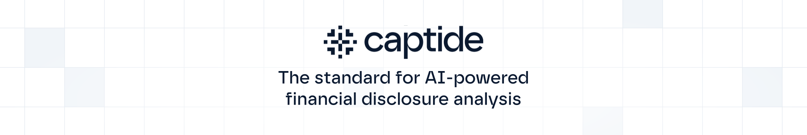

<div align="center">
  
  <h1>captide.js</h1>
  <p>
    <a href="https://www.npmjs.com/package/captide"></a>
    <a href="https://www.npmjs.com/package/captide"></a>
    <a href="https://github.com/captide/captide.js/blob/main/LICENSE"></a>
    <a href="https://www.linkedin.com/company/captide"></a>
  </p>
  <p><strong><a href="https://captide.co">Visit our website</a> | <a href="https://app.captide.co">Try our app</a> | <a href="https://docs.captide.co">Documentation</a></strong></p>
  <br/>
</div>

## Overview

Captide enables precise querying across over millions filings and earnings calls, offering best-in-class accuracy for financial analysis. It streamlines data extraction, investment research, and document review—accessible through a user-friendly interface at [app.captide.co](https://app.captide.co) or directly via API.

## About This Package

This npm package provides a document viewer designed to display source documents obtained via Captide's REST API. It is specifically developed to support source linking to answers given by Captide's AI agents that perform Q&A over financial disclosures. The viewer can display HTML, PDF, or XLSX documents and automatically scroll and highlight specific parts in these source documents that correspond to parts of the answer obtained through the API. This helps attribute the AI agent's outputs—such as specific sentences or metrics—directly to their original sources, rendering SEC filings, earnings call transcripts, and international disclosures with precise highlighting of relevant sections.

# Yarn Usage

This project now uses [Yarn](https://yarnpkg.com/) as its package manager. Please use the following commands:

## Install dependencies

```sh
yarn install
```

## Run the development server

```sh
yarn start
```

## Build for production

```sh
yarn build
```

## Usage Examples

### Basic Document Loading

```javascript
import { useDocumentViewer } from '@contexts/document-viewer-context';

const { loadDocument } = useDocumentViewer();

// Load a document by ID
await loadDocument('document-id-123');
```

### Document Loading with Citation Highlighting

```javascript
import { useDocumentViewer } from '@contexts/document-viewer-context';

const { loadDocument } = useDocumentViewer();

// Load a document and highlight specific text
await loadDocument('document-id-123', {
  page: 12,
  snippet: 'Total net sales $95,359 $90,753 $219,659 $210,328',
  matchIndex: 1
});
```

The citation snippet feature provides intelligent text search that can handle:
- **Table data with varying spacing** (e.g., financial data in rows)
- **Whitespace and punctuation differences** between the excerpt and the extracted text
- **Long excerpts** whose tail doesn't match, by falling back to a prefix
- **Repeated text**, via `matchIndex` (1-based, defaults to the first match)
- **Passages spanning a page break**
- **Per-line highlighting**, scrolled to the passage rather than the page

The positional form `loadDocument(documentId, pageNumber?, citationSnippet?, legacyElementId?)`
still works; only the options form accepts `matchIndex`.

### Find in document

Pass `enableSearch` to add a find control to the viewer toolbar:

```jsx
<DocumentViewer enableSearch />
```

It adds a search button next to the zoom controls, which expands in place into a
find bar. The bar opens with `Ctrl/Cmd+F` while the viewer has focus, closes with
`Escape`, reports the match count, and steps between matches with the arrows or
`Enter` / `Shift+Enter`. Search is case-insensitive. Matching and highlighting are
done by PDF.js's own `PDFFindController` against the rendered text layer.

The shortcut is bound to the viewer element rather than the document, so
`Ctrl/Cmd+F` keeps working as the browser's own find everywhere else on the page.

#### Driving the find bar from the host

When the viewer owns the whole screen, "only while focused" is too narrow — the
user expects `Ctrl/Cmd+F` to reach it wherever focus happens to be. Take a ref
to set your own policy:

```jsx
const viewerRef = useRef(null)

useEffect(() => {
  const onKeyDown = (e) => {
    if ((e.metaKey || e.ctrlKey) && e.key.toLowerCase() === 'f') {
      e.preventDefault()
      viewerRef.current?.openSearch()
    } else if (e.key === 'Escape' && viewerRef.current?.isSearchOpen()) {
      e.stopPropagation()
      viewerRef.current.closeSearch()
    }
  }
  window.addEventListener('keydown', onKeyDown, true)
  return () => window.removeEventListener('keydown', onKeyDown, true)
}, [])

<DocumentViewer enableSearch ref={viewerRef} />
```

The handle is `{ openSearch, closeSearch, isSearchOpen, getSelectionAnchor }`;
`openSearch` is a no-op unless `enableSearch` is set. Listening in the capture phase is what lets
`Escape` close the find bar before a host-level handler closes the viewer around
it. The viewer's own `Escape` also stops propagating once it has closed the bar,
so a host that closes on `Escape` won't do both at once.

### Linking to a passage

`getSelectionAnchor()` turns whatever the user has selected in the viewer into an
anchor you can put in a URL, and hand back to `loadDocument` later:

```jsx
const anchor = viewerRef.current?.getSelectionAnchor()
// { text: 'Revenue increased 15%…', page: 12, matchIndex: 2 }

if (anchor) {
  const url = new URL(`/filings/${documentId}`, location.origin)
  url.searchParams.set('excerpt', anchor.text)
  if (anchor.page) url.searchParams.set('page', String(anchor.page))
  if (anchor.matchIndex) url.searchParams.set('match', String(anchor.matchIndex))
  await navigator.clipboard.writeText(url.toString())
}
```

It returns `null` unless both ends of the selection sit inside the viewer, so a
selection elsewhere on the page won't produce a bogus anchor. `page` and
`matchIndex` are omitted when the page can't be determined; the excerpt alone
still highlights, searching the whole document for the first match.

Highlight colors follow the same CSS variable convention as the rest of the
viewer:

```css
:root {
  --captidejs-find-highlight-bg: rgba(255, 235, 59, 0.3);
  --captidejs-find-highlight-selected-bg: rgba(255, 235, 59, 0.5);
}
```

Every control in the overlay toolbar — the page indicator, find, `Open`, zoom and
download — shares one border color, tunable the same way:

```css
:root {
  --captidejs-toolbar-border-color: #cbd5e1;
}
```

## PDF text selection / Ctrl+F alignment (PDF.js vs native viewer)

This package uses PDF.js to render PDFs. PDF.js renders the page visually to a canvas, and reconstructs a separate HTML "text layer" for selection and find/highlighting. Some PDFs (fonts/transforms/OCR quirks) can cause that reconstructed text layer to be offset from the canvas, leading to shifted selection boxes or Ctrl/Cmd+F highlights.

`DocumentViewer` supports choosing the renderer:

- `renderMode="pdfjs"`: default, feature-rich (custom overlays, PDF.js find UI, etc.)
- `renderMode="native"`: uses the browser's built-in PDF viewer (Safari uses PDFKit; best for accurate selection/highlights)
- `renderMode="auto"`: uses native on Safari, PDF.js elsewhere

Note: embedding PDFs via `<iframe>` can be blocked by the PDF host via `X-Frame-Options` or CSP `frame-ancestors`. If that happens, use the "Open" button (opens the PDF in a new tab using the browser's native viewer).

## API Access

To request a Captide API license, please contact our sales team at [sales@captide.co](mailto:sales@captide.co).

> **Important Note**: While this npm package (the document viewer component) is available under the MIT license, access to the Captide REST API for retrieving and querying documents requires a separate commercial license. The MIT license applies only to the frontend code in this repository.

## Resources

- **Documentation**: [docs.captide.co](https://docs.captide.co)
- **Website**: [captide.co](https://captide.co)
- **Application**: [app.captide.co](https://app.captide.co) 